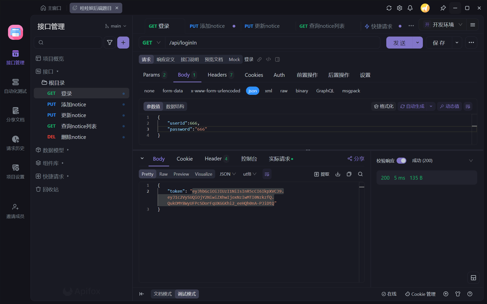

# 后端测试题（2024.7.3~2024.7.5）

## 完成情况

- [x] 增加提醒信息
- [x] 本人的提醒信息列表
- [x] 删除提醒
- [x] 更改提醒时间或者内容
- [x] REST 接口实现创建者校验
- [ ] 编写单元测试代码（未开始）
- [x] Apifox接口测试
- [ ] 通过 WebSocket 推送提醒消息（未完成）
- [x] 编写应用编译打包的 Dockerfile （未开始）
- [x] 把代码提交到 github/gitlab/gitee 的其中一个（未开始）
- [ ] 邮件或短信提醒

## 更新思路

- [ ] 数据库更改后，将信息添加到消息队列，websocket连接中处理消息，重新拉取用户notice列表
- [ ] 轮询检测notice列表中的数据，如果距离提醒时间不足5秒，将该notice发送给前端

## 测试题原题

**请使用Go语言编写一个日历提醒服务，实现以下功能**：

###  **（一）、基础功能，必须实现：**

**1、每一条提醒信息需包含**

1）创建者ID

2）提醒内容

3）提醒时间

**2、实现 REST 风格的提醒信息管理接口，包括以下四点：**

1)增加提醒信息；

2)本人的提醒信息列表；

3)删除提醒；

4)更改提醒时间或者内容
**3、REST 接口需实现创建者校验，即每个人只能管理本人的提醒信息**
**4**、编写单元测试代码
**5、把代码提交到 github/gitlab/gitee 的其中一个**

### **（二）、可选功能：**

\1. 创建提醒信息时可指定通过邮件或者短信进行提醒；当到达提醒时刻则通过对应方式发送提醒信息
\2. 提供 WebSocket 接口，当到达提醒时刻通过 WebSocket 推送提醒消息
\3. 编写应用编译打包的 Dockerfile

**备注：**

1、该测试用时预计1-3天，根据每人的实际能力而定

2、做完测试提交后，请及时联系HR

3、若测试题通过后，我们会告知您再安排面试

4、做题过程中有任何疑问的，可以询问HR

## 功能分析

1. setNotice：用户创建提醒信息(给自己)
2. getNoticeList：用户查看属于自己的提醒消息列表
3. deleteNotice：用户删除提醒消息(给自己)
4. updateNotice：用户更改提醒时间或内容
5. loginIn：验证信息并获取jwt
6. WSNotice：提醒用户（WebSocket推送消息）

## 数据库

### user表

用户ID

用户密码

### notify表

ID
通知创建者id
提醒内容
提醒时间

## API接口测试

完整截图在项目的API-TEST目录中


### /api/WSNotice

### /api/deleteNotice

### /api/getNoticeList

### /api/loginIn

### /api/setNotice

### /api/updateNotice

## 程序运行

准备工作：

1. 修改配置文件中的mysql数据源（.\wawayu-notify\notify-api\etc\notify.yaml）
2. 数据库创建，创建notify数据库，执行.\mysql\db.sql（docker构建跳过）

### 本地运行

```
cd .\wawayu-notify\notify-api\ #进入目录下
go run notify.go
```

账号为666，密码为666，拿到token后可以进行操作

### docker构建

项目目录下

```shell
docker-compose up --build -d
```

数据库已加载，账号为666，密码为666，拿到token后可以进行操作

